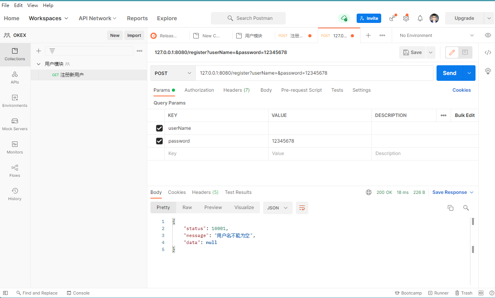

## 0 项目开始准备
### 0.1 新建工程


### 0.2 新建数据库dd-mall后使用idea连接


使用`dd_mall_local.sql`导入表

### 0.3 导入pom依赖
在原有基础上添加如下依赖
- mybatis依赖
- mysql依赖
- mybatis.generator插件

```
```xml
<?xml version="1.0" encoding="UTF-8"?>
<project xmlns="http://maven.apache.org/POM/4.0.0" xmlns:xsi="http://www.w3.org/2001/XMLSchema-instance"
         xsi:schemaLocation="http://maven.apache.org/POM/4.0.0 https://maven.apache.org/xsd/maven-4.0.0.xsd">
    <modelVersion>4.0.0</modelVersion>
    <parent>
        <groupId>org.springframework.boot</groupId>
        <artifactId>spring-boot-starter-parent</artifactId>
        <version>2.6.7</version>
        <relativePath/> <!-- lookup parent from repository -->
    </parent>
    <groupId>net.kokwind</groupId>
    <artifactId>mall</artifactId>
    <version>0.0.1-SNAPSHOT</version>
    <name>mall</name>
    <description>mall</description>
    <properties>
        <java.version>1.8</java.version>
    </properties>
    <dependencies>
        <dependency>
            <groupId>org.springframework.boot</groupId>
            <artifactId>spring-boot-starter-web</artifactId>
        </dependency>

        <dependency>
            <groupId>org.springframework.boot</groupId>
            <artifactId>spring-boot-starter-test</artifactId>
            <scope>test</scope>
        </dependency>
        <!-- mybatis依赖 -->
        <dependency>
            <groupId>org.mybatis.spring.boot</groupId>
            <artifactId>mybatis-spring-boot-starter</artifactId>
            <version>2.2.2</version>
        </dependency>
        <!-- mysql依赖 -->
        <dependency>
            <groupId>mysql</groupId>
            <artifactId>mysql-connector-java</artifactId>
        </dependency>

    </dependencies>

    <build>
        <plugins>
            <plugin>
                <groupId>org.springframework.boot</groupId>
                <artifactId>spring-boot-maven-plugin</artifactId>
            </plugin>
            <!-- mybatis.generator插件 -->
            <plugin>
                <groupId>org.mybatis.generator</groupId>
                <artifactId>mybatis-generator-maven-plugin</artifactId>
                <version>1.4.1</version>
                <configuration>
                    <verbose>true</verbose>
                    <overwrite>true</overwrite>
                </configuration>
            </plugin>
        </plugins>
    </build>

</project>

```

### 0.4 新建配置文件
#### 0.4.1 创建application.properties
配置mysql连接
配置log
配置mybatis mapper位置，好让spring boot自动扫描

```
spring.application.name=dd_mall
spring.datasource.name=dd_mall_datasource
spring.datasource.url=jdbc:mysql://139.186.157.42:28001/dd_mall?useUnicode=true&characterEncoding=utf8&autoReconnect=true&useSSL=false&serverTimezone=Asia/Shanghai
spring.datasource.driver-class-name=com.mysql.cj.jdbc.Driver
spring.datasource.username=root
spring.datasource.password=ibm99ibm
logging.config=classpath:logback-spring.xml
logging.level.root=INFO
logging.level.org.mybatis=debug
logging.level.dao=debug
logging.file.path=d:/logs

mybatis.mapper-locations=classpath:mappers/*.xml

```
#### 0.4.2 创建logback-spring.xml
logback位置，设置日志记录规则并保存在本地，位置在logs文件夹下
修改`application.properties`中的`logging.file.path`参数，相关参数是`logging`开头的字段。

```
```xml
<?xml version="1.0" encoding="UTF-8"?>
<!-- 日志级别从低到高分为TRACE < DEBUG < INFO < WARN < ERROR < FATAL，如果设置为WARN，则低于WARN的信息都不会输出 -->
<!-- scan:当此属性设置为true时，配置文档如果发生改变，将会被重新加载，默认值为true -->
<!-- scanPeriod:设置监测配置文档是否有修改的时间间隔，如果没有给出时间单位，默认单位是毫秒。
       当scan为true时，此属性生效。默认的时间间隔为1分钟。 -->
<!-- debug:当此属性设置为true时，将打印出logback内部日志信息，实时查看logback运行状态。默认值为false。 -->
<configuration scan="true" scanPeriod="10 seconds">
<!--    <include resource="org/springframework/boot/logging/logback/base.xml" />-->
    <contextName>logback-spring</contextName>

    <!-- name的值是变量的名称，value的值时变量定义的值。通过定义的值会被插入到logger上下文中。定义后，可以使“${}”来使用变量。 -->

    <!--   *******************需要更改该，写自己的保存路径***************************    -->
    <!--    这里用来指定地址   Value= ********** ,这种格式的配置信息，下面有很多，比如日志格式等-->
<!--     <property name="logging.file.path" value="${logging.file.path}" />-->
    <springProperty scope="context" name="logging.file.path" source="logging.file.path"/>

    <!--0. 日志格式和颜色渲染 -->
    <!-- 彩色日志依赖的渲染类 -->
    <conversionRule conversionWord="clr" converterClass="org.springframework.boot.logging.logback.ColorConverter" />
    <conversionRule conversionWord="wex" converterClass="org.springframework.boot.logging.logback.WhitespaceThrowableProxyConverter" />
    <conversionRule conversionWord="wEx" converterClass="org.springframework.boot.logging.logback.ExtendedWhitespaceThrowableProxyConverter" />
    <!-- 彩色日志格式 -->
    <property name="CONSOLE_LOG_PATTERN" value="${CONSOLE_LOG_PATTERN:-%clr(%d{yyyy-MM-dd HH:mm:ss.SSS}){faint} %clr(${LOG_LEVEL_PATTERN:-%5p}) %clr(${PID:- }){magenta} %clr(---){faint} %clr([%15.15t]){faint} %clr(%-40.40logger{39}){cyan} %clr(:){faint} %m%n${LOG_EXCEPTION_CONVERSION_WORD:-%wEx}}"/>

    <!--1. 输出到控制台-->
    <appender name="CONSOLE" class="ch.qos.logback.core.ConsoleAppender">
        <!--此日志appender是为开发使用，只配置最底级别，控制台输出的日志级别是大于或等于此级别的日志信息-->
        <!--<filter class="ch.qos.logback.classic.filter.ThresholdFilter">-->
        <!--<level>INFO</level>-->
        <!--</filter>-->
        <encoder>
            <Pattern>${CONSOLE_LOG_PATTERN}</Pattern>
            <!-- 设置字符集 -->
            <charset>UTF-8</charset>
        </encoder>
    </appender>

    <!--2. 输出到文档-->
    <!-- 2.1 level为 DEBUG 日志，时间滚动输出 -->
    <appender name="DEBUG_FILE" class="ch.qos.logback.core.rolling.RollingFileAppender">
        <!-- 正在记录的日志文档的路径及文档名 -->
        <file>${logging.file.path}/web_debug.log</file>
        <!--日志文档输出格式-->
        <encoder>
            <pattern>%d{yyyy-MM-dd HH:mm:ss.SSS} [%thread] %-5level %logger{50} - %msg%n</pattern>
            <charset>UTF-8</charset> <!-- 设置字符集 -->
        </encoder>
        <!-- 日志记录器的滚动策略，按日期，按大小记录 -->
        <rollingPolicy class="ch.qos.logback.core.rolling.TimeBasedRollingPolicy">
            <!-- 日志归档 -->
            <fileNamePattern>${logging.file.path}/debug/web-debug-%d{yyyy-MM-dd}.%i.log</fileNamePattern>
            <timeBasedFileNamingAndTriggeringPolicy class="ch.qos.logback.core.rolling.SizeAndTimeBasedFNATP">
                <maxFileSize>10MB</maxFileSize>
            </timeBasedFileNamingAndTriggeringPolicy>
            <!--日志文档保留天数-->
            <maxHistory>15</maxHistory>
        </rollingPolicy>
        <!-- 此日志文档只记录debug级别的 -->
        <filter class="ch.qos.logback.classic.filter.LevelFilter">
            <level>debug</level>
            <onMatch>ACCEPT</onMatch>
            <onMismatch>DENY</onMismatch>
        </filter>
    </appender>

    <!-- 2.2 level为 INFO 日志，时间滚动输出 -->
    <appender name="INFO_FILE" class="ch.qos.logback.core.rolling.RollingFileAppender">
        <!-- 正在记录的日志文档的路径及文档名 -->
        <file>${logging.file.path}/web_info.log</file>
        <!--日志文档输出格式-->
        <encoder>
            <pattern>%d{yyyy-MM-dd HH:mm:ss.SSS} [%thread] %-5level %logger{50} - %msg%n</pattern>
            <charset>UTF-8</charset>
        </encoder>
        <!-- 日志记录器的滚动策略，按日期，按大小记录 -->
        <rollingPolicy class="ch.qos.logback.core.rolling.TimeBasedRollingPolicy">
            <!-- 每天日志归档路径以及格式 -->
            <fileNamePattern>${logging.file.path}/info/web-info-%d{yyyy-MM-dd}.%i.log</fileNamePattern>
            <timeBasedFileNamingAndTriggeringPolicy class="ch.qos.logback.core.rolling.SizeAndTimeBasedFNATP">
                <maxFileSize>10MB</maxFileSize>
            </timeBasedFileNamingAndTriggeringPolicy>
            <!--日志文档保留天数-->
            <maxHistory>15</maxHistory>
        </rollingPolicy>
        <!-- 此日志文档只记录info级别的 -->
        <filter class="ch.qos.logback.classic.filter.LevelFilter">
            <level>info</level>
            <onMatch>ACCEPT</onMatch>
            <onMismatch>DENY</onMismatch>
        </filter>
    </appender>

    <!-- 2.3 level为 WARN 日志，时间滚动输出 -->
    <appender name="WARN_FILE" class="ch.qos.logback.core.rolling.RollingFileAppender">
        <!-- 正在记录的日志文档的路径及文档名 -->
        <file>${logging.file.path}/web_warn.log</file>
        <!--日志文档输出格式-->
        <encoder>
            <pattern>%d{yyyy-MM-dd HH:mm:ss.SSS} [%thread] %-5level %logger{50} - %msg%n</pattern>
            <charset>UTF-8</charset> <!-- 此处设置字符集 -->
        </encoder>
        <!-- 日志记录器的滚动策略，按日期，按大小记录 -->
        <rollingPolicy class="ch.qos.logback.core.rolling.TimeBasedRollingPolicy">
            <fileNamePattern>${logging.file.path}/warn/web-warn-%d{yyyy-MM-dd}.%i.log</fileNamePattern>
            <timeBasedFileNamingAndTriggeringPolicy class="ch.qos.logback.core.rolling.SizeAndTimeBasedFNATP">
                <maxFileSize>10MB</maxFileSize>
            </timeBasedFileNamingAndTriggeringPolicy>
            <!--日志文档保留天数-->
            <maxHistory>15</maxHistory>
        </rollingPolicy>
        <!-- 此日志文档只记录warn级别的 -->
        <filter class="ch.qos.logback.classic.filter.LevelFilter">
            <level>warn</level>
            <onMatch>ACCEPT</onMatch>
            <onMismatch>DENY</onMismatch>
        </filter>
    </appender>

    <!-- 2.4 level为 ERROR 日志，时间滚动输出 -->
    <appender name="ERROR_FILE" class="ch.qos.logback.core.rolling.RollingFileAppender">
        <!-- 正在记录的日志文档的路径及文档名 -->
        <file>${logging.file.path}/web_error.log</file>
        <!--日志文档输出格式-->
        <encoder>
            <pattern>%d{yyyy-MM-dd HH:mm:ss.SSS} [%thread] %-5level %logger{50} - %msg%n</pattern>
            <charset>UTF-8</charset> <!-- 此处设置字符集 -->
        </encoder>
        <!-- 日志记录器的滚动策略，按日期，按大小记录 -->
        <rollingPolicy class="ch.qos.logback.core.rolling.TimeBasedRollingPolicy">
            <fileNamePattern>${logging.file.path}/error/web-error-%d{yyyy-MM-dd}.%i.log</fileNamePattern>
            <timeBasedFileNamingAndTriggeringPolicy class="ch.qos.logback.core.rolling.SizeAndTimeBasedFNATP">
                <maxFileSize>10MB</maxFileSize>
            </timeBasedFileNamingAndTriggeringPolicy>
            <!--日志文档保留天数-->
            <maxHistory>15</maxHistory>
        </rollingPolicy>
        <!-- 此日志文档只记录ERROR级别的 -->
        <filter class="ch.qos.logback.classic.filter.LevelFilter">
            <level>ERROR</level>
            <onMatch>ACCEPT</onMatch>
            <onMismatch>DENY</onMismatch>
        </filter>
    </appender>

    <!--
      <logger>用来设置某一个包或者具体的某一个类的日志打印级别、
      以及指定<appender>。<logger>仅有一个name属性，
      一个可选的level和一个可选的addtivity属性。
      name:用来指定受此logger约束的某一个包或者具体的某一个类。
      level:用来设置打印级别，大小写无关：TRACE, DEBUG, INFO, WARN, ERROR, ALL 和 OFF，
         还有一个特俗值INHERITED或者同义词NULL，代表强制执行上级的级别。
         如果未设置此属性，那么当前logger将会继承上级的级别。
      addtivity:是否向上级logger传递打印信息。默认是true。
      <logger name="org.springframework.web" level="info"/>
      <logger name="org.springframework.scheduling.annotation.ScheduledAnnotationBeanPostProcessor" level="INFO"/>
    -->

    <!--
      使用mybatis的时候，sql语句是debug下才会打印，而这里我们只配置了info，所以想要查看sql语句的话，有以下两种操作：
      第一种把<root level="info">改成<root level="DEBUG">这样就会打印sql，不过这样日志那边会出现很多其他消息
      第二种就是单独给dao下目录配置debug模式，代码如下，这样配置sql语句会打印，其他还是正常info级别：
      【logging.level.org.mybatis=debug logging.level.dao=debug】
     -->

    <!--
      root节点是必选节点，用来指定最基础的日志输出级别，只有一个level属性
      level:用来设置打印级别，大小写无关：TRACE, DEBUG, INFO, WARN, ERROR, ALL 和 OFF，
      不能设置为INHERITED或者同义词NULL。默认是DEBUG
      可以包含零个或多个元素，标识这个appender将会添加到这个logger。
    -->

    <!-- 4. 最终的策略 -->
    <!-- 4.1 开发环境:打印控制台-->
    <!--  <springProfile name="dev">-->
    <logger name="net.kokwind.mall" level="debug"/><!-- 修改此处扫描包名 -->
    <!--  </springProfile>-->

    <root level="info">
        <appender-ref ref="CONSOLE" />
        <appender-ref ref="DEBUG_FILE" />
        <appender-ref ref="INFO_FILE" />
        <appender-ref ref="WARN_FILE" />
        <appender-ref ref="ERROR_FILE" />
    </root>

    <!--   4.2 生产环境:输出到文档-->
    <springProfile name="pro">
        <root level="info">
            <appender-ref ref="CONSOLE" />
            <appender-ref ref="DEBUG_FILE" />
            <appender-ref ref="INFO_FILE" />
            <appender-ref ref="ERROR_FILE" />
            <appender-ref ref="WARN_FILE" />
        </root>
    </springProfile>
</configuration>
```

输出如下：


### 0.5 新建`generatorConfig.xml`
配置mybatis-generator
修改点：
- 数据库驱动个人配置，驱动的位置
- 数据库链接地址账号密码
- 修改生成对应表及类名即可

```xml
<?xml version="1.0" encoding="UTF-8"?>
<!DOCTYPE generatorConfiguration
  PUBLIC "-//mybatis.org//DTD MyBatis Generator Configuration 1.0//EN"
  "http://mybatis.org/dtd/mybatis-generator-config_1_0.dtd">
<generatorConfiguration>
  <!-- 配置文件，放在resource目录下即可 -->
  <!--数据库驱动个人配置-->
  <classPathEntry
    location="src/main/resources/mysql-connector-java-8.0.28.jar"/>
  <context id="MysqlTables" targetRuntime="MyBatis3">
    <property name="autoDelimitKeywords" value="true"/>
    <!--可以使用``包括字段名，避免字段名与sql保留字冲突报错-->
    <property name="beginningDelimiter" value="`"/>
    <property name="endingDelimiter" value="`"/>
    <!-- optional，旨在创建class时，对注释进行控制 -->
    <commentGenerator>
      <property name="suppressDate" value="true"/>
      <property name="suppressAllComments" value="true"/>
    </commentGenerator>
    <!--数据库链接地址账号密码-->
    <jdbcConnection driverClass="com.mysql.cj.jdbc.Driver"
      connectionURL="jdbc:mysql://139.186.157.42:28001/dd_mall?useUnicode=true&amp;characterEncoding=UTF-8&amp;zeroDateTimeBehavior=convertToNull"
      userId="root"
      password="ibm99ibm">
      <property name="nullCatalogMeansCurrent" value="true"/>
    </jdbcConnection>
    <!-- 非必需，类型处理器，在数据库类型和java类型之间的转换控制-->
    <javaTypeResolver>
      <property name="forceBigDecimals" value="false"/>
    </javaTypeResolver>
    <!--生成Model类存放位置-->
    <javaModelGenerator targetPackage="net.kokwind.mall.model.entity"
      targetProject="src/main/java">
      <!-- 是否允许子包，即targetPackage.schemaName.tableName -->
      <property name="enableSubPackages" value="true"/>
      <!-- 是否对类CHAR类型的列的数据进行trim操作 -->
      <property name="trimStrings" value="true"/>
      <!-- 建立的Model对象是否 不可改变  即生成的Model对象不会有 setter方法，只有构造方法 -->
      <property name="immutable" value="false"/>
    </javaModelGenerator>
    <!--生成mapper映射文件存放位置-->
    <sqlMapGenerator targetPackage="mappers" targetProject="src/main/resources">
      <property name="enableSubPackages" value="true"/>
    </sqlMapGenerator>
    <!--生成Dao类存放位置-->
    <javaClientGenerator type="XMLMAPPER" targetPackage="net.kokwind.mall.model.dao"
      targetProject="src/main/java">
      <property name="enableSubPackages" value="true"/>
    </javaClientGenerator>
    <!--生成对应表及类名-->
    <table schema="root" tableName="dd_mall_cart" domainObjectName="Cart"
      enableCountByExample="false"
      enableUpdateByExample="false" enableDeleteByExample="false" enableSelectByExample="false"
      selectByExampleQueryId="false">
    </table>
    <table tableName="dd_mall_category" domainObjectName="Category" enableCountByExample="false"
      enableUpdateByExample="false" enableDeleteByExample="false" enableSelectByExample="false"
      selectByExampleQueryId="false">
    </table>
    <table tableName="dd_mall_order" domainObjectName="Order" enableCountByExample="false"
      enableUpdateByExample="false" enableDeleteByExample="false" enableSelectByExample="false"
      selectByExampleQueryId="false">
    </table>
    <table tableName="dd_mall_order_item" domainObjectName="OrderItem"
      enableCountByExample="false"
      enableUpdateByExample="false" enableDeleteByExample="false" enableSelectByExample="false"
      selectByExampleQueryId="false">
    </table>
    <table tableName="dd_mall_product" domainObjectName="Product" enableCountByExample="false"
      enableUpdateByExample="false" enableDeleteByExample="false" enableSelectByExample="false"
      selectByExampleQueryId="false">
    </table>
    <table tableName="dd_mall_user" domainObjectName="User" enableCountByExample="false"
      enableUpdateByExample="false" enableDeleteByExample="false" enableSelectByExample="false"
      selectByExampleQueryId="false">
    </table>

  </context>
</generatorConfiguration>

```

### 0.6 使用mybatis-generator生成代码
点击`mybatis-generator：generate`生成


生成代码如下


此时用idea写一个实现类引用mapper类来调用dao层的处理，使用@Autowired注解时被标红线，找不到bean。


因为我们在`application.properties`里配置了扫描包地址`mybatis.mapper-locations=classpath:mappers/*.xml`,并在程序入口配置了@MapperScan
```java
package net.kokwind.mall;

import org.mybatis.spring.annotation.MapperScan;
import org.springframework.boot.SpringApplication;
import org.springframework.boot.autoconfigure.SpringBootApplication;

@SpringBootApplication
@MapperScan("net.kokwind.mall.model.dao")
public class MallApplication {
    public static void main(String[] args) {
        SpringApplication.run(MallApplication.class, args);
    }
}

```
所以程序可以正常运行，但是idea提示找不到bean。

所以还需要加上@Respository注解，这样就不标红了。

也可以加@Mapper注解，这两种注解的区别是@Mapper注解是指定mapper类，而@Respository注解是指定mapper类的实现类。
1. 使用@Mapper注解后，不需要在Spring配置中设置扫描地址，通过mapper.xml里面的namesapce属性对应相关的mapper类，spring将动态的生成Bean后注入到Service层。
2. 使用@Repository注解则需要在Spring中配置扫描包地址，然后生成dao层的bean之后，再注入到Service层。
例如：
```java
package net.kokwind.mall.model.dao;

import net.kokwind.mall.model.entity.User;
import org.springframework.stereotype.Repository;
@Repository
public interface UserMapper {
    int deleteByPrimaryKey(Integer id);

    int insert(User row);

    int insertSelective(User row);

    User selectByPrimaryKey(Integer id);

    int updateByPrimaryKeySelective(User row);

    int updateByPrimaryKey(User row);
}
```

### 0.7 测试是否正常运行
#### 0.7.1 编写测试UserService
```java
package net.kokwind.mall.service;

import net.kokwind.mall.model.dao.UserMapper;
import net.kokwind.mall.model.entity.User;
import org.springframework.beans.factory.annotation.Autowired;
import org.springframework.stereotype.Service;

@Service
public class UserService {
    @Autowired
    private UserMapper userMapper;

    public User getUser(){
        return userMapper.selectByPrimaryKey(1);
    }
}
```

#### 0.7.2 编写测试UserController

```java
package net.kokwind.mall.controller;

import net.kokwind.mall.model.entity.User;
import net.kokwind.mall.service.UserService;
import org.springframework.beans.factory.annotation.Autowired;
import org.springframework.web.bind.annotation.GetMapping;
import org.springframework.web.bind.annotation.RestController;

@RestController
public class UserController {
    @Autowired
    private UserService userService;

    @GetMapping("/user")
    public User getUser() {
        return userService.getUser();
    }
}
```

#### 0.7.3 测试是否正常运行


### 0.8 AOP同意处理Web请求日志
用filter把每个请求都打印出来，可以看到请求的url和参数。可以提高开发和调试的效率
创建filter把请求的信息和返回的信息都打印出来。

添加AOP依赖
```
        <!-- AOP依赖 -->
        <dependency>
            <groupId>org.springframework.boot</groupId>
            <artifactId>spring-boot-starter-aop</artifactId>
        </dependency>
```
新建实现截取请求响应的AOP类
```java
package net.kokwind.mall.filter;

import com.fasterxml.jackson.core.JsonProcessingException;
import com.fasterxml.jackson.databind.ObjectMapper;
import org.aspectj.lang.JoinPoint;
import org.aspectj.lang.annotation.AfterReturning;
import org.aspectj.lang.annotation.Aspect;
import org.aspectj.lang.annotation.Before;
import org.aspectj.lang.annotation.Pointcut;
import org.slf4j.Logger;
import org.slf4j.LoggerFactory;
import org.springframework.stereotype.Component;
import org.springframework.web.context.request.RequestContextHolder;
import org.springframework.web.context.request.ServletRequestAttributes;

import javax.servlet.http.HttpServletRequest;
import java.util.Arrays;

/**
 * 描述：打印请求和响应信息
 */
@Aspect
@Component
public class WebLogAspect {
    private final Logger log = LoggerFactory.getLogger(WebLogAspect.class);

    @Pointcut("execution(public * net.kokwind.mall.controller.*.*(..)))")
    public void webLog() {

    }

    @Before("webLog()")
    public void doBefore(JoinPoint joinPoint) {
        //收到请求，记录请求内容
        ServletRequestAttributes attributes = (ServletRequestAttributes) RequestContextHolder
                .getRequestAttributes();
        HttpServletRequest request = attributes.getRequest();

        log.info("URL : " + request.getRequestURL().toString());
        log.info("HTTP_METHOD :" + request.getMethod());
        log.info("IP : " + request.getRemoteAddr());
        log.info("CLASS_METHOD : " + joinPoint.getSignature().getDeclaringTypeName() + "."
                + joinPoint.getSignature().getName());
        log.info("ARGS : " + Arrays.toString(joinPoint.getArgs()));
    }

    @AfterReturning(returning = "res", pointcut = "webLog()")
    public void doAfterReturning(Object res) throws JsonProcessingException {
        //处理完请求，返回内容
        log.info("RESPONSE : " + new ObjectMapper().writeValueAsString(res));
    }
}

```
重新启动，再次请求user接口


## 1 用户模块


### 1.1 接口文档

#### 1.1.1 注册新用户

| 注册新用户 |           |
| ---------- | --------- |
| 请求地址   | /register |
| 请求方式   | POST      |

| 参数     | 参数含义 |
| -------- | -------- |
| UserName | 用户名   |
| password | 密码     |

请求示例

```
/register?userName=onezos&password=12345678
```

返回示例

```
{
  "status": 10000,
  "msg": "SUCCESS",
  "data": null
}
```


#### 1.1.2 登录

| 请求地址 | /login |
| -------- | ------ |
| 请求方式 | POST   |

参数

| 参数     | 参数含义 | 示例     | 备注 |
| -------- | -------- | -------- | ---- |
| userName | 用户名   | onezos   |      |
| password | 密码     | 12345678 |      |

返回示例

```
{
  "status": 10000,
  "msg": "SUCCESS",
  "data": {
    "id": 9,
    "username": "onezos",
    "password": null,
    "personalizedSignature": "祝你今天好心情",
    "role": 2,
    "createTime": "2022-04-27T12:39:47.000+0000",
    "updateTime": "2022-04-27T16:56:02.000+0000"
  }
}
```


#### 1.1.3 更新个性签名 

| 请求地址 | /user/update |
| -------- | ------------ |
| 请求方式 | POST         |

参数

| 参数      | 参数含义       | 示例           | 备注 |
| --------- | -------------- | -------------- | ---- |
| signature | 更新的签名内容 | 更新了我的签名 |      |

请求示例

```
/user/update?signature=更新了我的签名
```

返回示例

```
{    "status": 10000,    "msg": "SUCCESS",    "data": null}
```


#### 1.1.4 退出登录

| 请求地址 | /user/logout |
| -------- | ------------ |
| 请求方式 | POST         |

参数

| 参数 | 参数含义 | 示例 | 备注 |
| ---- | -------- | ---- | ---- |
| 无   |          |      |      |

请求示例

```
/user/logout
```

返回示例

```
{    "status": 10000,    "msg": "SUCCESS",    "data": null}
```


#### 1.1.5 管理员登录

| 请求地址 | /adminLogin |
| -------- | ----------- |
| 请求方式 | POST        |

参数

| 参数     | 参数含义 | 示例     | 备注 |
| -------- | -------- | -------- | ---- |
| userName | 用户名   | onezos   |      |
| password | 密码     | 12345678 |      |

请求示例

```
/adminLogin?userName=onezos&password=12345678
```

返回示例

```
{
  "status": 10000,
  "msg": "SUCCESS",
  "data": {
    "id": 9,
    "username": "onezos",
    "password": null,
    "personalizedSignature": "祝你今天好心情",
    "role": 2,
    "createTime": "2022-04-26T12:39:47.000+0000",
    "updateTime": "2022-04-27T16:56:02.000+0000"
  }
}
```


### 1.2 编写注册新用户

#### 1.2.1 编写service

注册新用户时，我们先插入两个字段，一个是用户名`userNmae`，一个是用户密码`password`，可以使用`mybatis-generator`自动生成的`insertSelective`的sql语句即可。

插入新用户的逻辑是要先进行判断用户名是否存在，如果存在则提示，然后才能写入数据表中。

```java
package net.kokwind.mall.service;

import net.kokwind.mall.exception.DdMallException;
import net.kokwind.mall.exception.DdMallExceptionEnum;
import net.kokwind.mall.model.dao.UserMapper;
import net.kokwind.mall.model.entity.User;
import org.springframework.beans.factory.annotation.Autowired;
import org.springframework.stereotype.Service;

@Service
public class UserService {
    @Autowired
    private UserMapper userMapper;

    public User getUser(){
        return userMapper.selectByPrimaryKey(1);
    }

    public void register(String userName, String password) throws DdMallException {
        //查询用户名是否存在，不允许重名
        User result = userMapper.selectByName(userName);
        if(result != null){
            throw new DdMallException(DdMallExceptionEnum.NAME_EXISTED);
        }
        //写到数据库
        User user = new User();
        user.setUsername(userName);
        user.setPassword(password);
        //只给选中的字段赋值用insertSelective，给每个字段赋值用insert
        int count = userMapper.insertSelective(user);
        if(count == 0){
            throw new DdMallException(DdMallExceptionEnum.REGISTER_FAILED);
        }
    }
}
```

#### 1.2.2 增加用用户名查询的mapper

`UserMapper`增加`selectByName`

```java
package net.kokwind.mall.model.dao;

import net.kokwind.mall.model.entity.User;
import org.springframework.stereotype.Repository;
@Repository
public interface UserMapper {
    int deleteByPrimaryKey(Integer id);

    int insert(User row);

    int insertSelective(User row);

    User selectByPrimaryKey(Integer id);

    int updateByPrimaryKeySelective(User row);

    int updateByPrimaryKey(User row);

    User selectByName(String userName);
```

`UserMapper.xml`增加`selectByName`

```
  <select id="selectByName" parameterType="java.lang.String" resultMap="BaseResultMap">
    select
    <include refid="Base_Column_List"/>
    from dd_mall_user
    where username = #{userName,jdbcType=VARCHAR}
  </select>
```


#### 1.2.3 编写统一异常

抛出异常时，看到新建了`DdMallException`类和`DdMallExceptionEnum`枚举。

代码如下

`DdMallExceptionEnum`放常用的消息枚举

```java
package net.kokwind.mall.exception;

public enum DdMallExceptionEnum {
    NEED_USER_NAME(10001, "用户名不能为空"),
    NEED_PASSWORD(10002, "密码不能为空"),
    PASSWORD_TOO_SHORT(10003, "密码长度不能小于8位"),
    NAME_EXISTED(10004, "用户名已存在"),
    REGISTER_FAILED(10005, "创建失败,请稍后重试");
    Integer code;
    String message;

    DdMallExceptionEnum(Integer code, String message) {
        this.code = code;
        this.message = message;
    }

    public Integer getCode() {
        return code;
    }

    public void setCode(Integer code) {
        this.code = code;
    }

    public String getMessage() {
        return message;
    }

    public void setMessage(String message) {
        this.message = message;
    }

}
```

`DdMallException`统一的异常调用

```java
package net.kokwind.mall.exception;

/**
 * 描述： 统一异常
 */
public class DdMallException extends Exception {
    private final Integer code;
    private final String message;

    public DdMallException(Integer code, String message) {
        this.code = code;
        this.message = message;
    }

    public DdMallException(DdMallExceptionEnum exceptionEnum) {
        this(exceptionEnum.getCode(), exceptionEnum.getMessage());
    }

    public Integer getCode() {
        return code;
    }

    @Override
    public String getMessage() {
        return message;
    }
}
```

#### 1.2.4 编写通用的统一返回类

返回示例

```
{
  "status": 10000,
  "msg": "SUCCESS",
  "data": null
}
```

新建类·

```java
package net.kokwind.mall.common;

import net.kokwind.mall.exception.DdMallExceptionEnum;

public class ApiRestResponse<T> {
    private Integer status;
    private String message;
    private T data;

    private static final int OK_CODE = 10000;
    private static final String OK_MSG = "SUCCESS";

    public ApiRestResponse(Integer status, String message, T data) {
        this.status = status;
        this.message = message;
        this.data = data;
    }

    public ApiRestResponse(Integer status, String message) {
        this.status = status;
        this.message = message;
    }

    public ApiRestResponse() {
        this(OK_CODE, OK_MSG);
    }

    public static <T> ApiRestResponse<T> success() {
        return new ApiRestResponse<>();
    }

    public static <T> ApiRestResponse<T> success(T result) {

        ApiRestResponse<T> response = new ApiRestResponse<>();
        response.setData(result);
        return response;
    }

    public static <T> ApiRestResponse<T> error(Integer code, String msg) {
        return new ApiRestResponse<>(code,msg);
    }

    public static <T> ApiRestResponse<T> error(DdMallExceptionEnum ex) {
        return new ApiRestResponse<>(ex.getCode(), ex.getMessage());
    }

    @Override
    public String toString() {
        return "ApiRestResponse{" +
                "status=" + status +
                ", message='" + message + '\'' +
                ", data=" + data +
                '}';
    }

    public Integer getStatus() {
        return status;
    }

    public void setStatus(Integer status) {
        this.status = status;
    }

    public String getMessage() {
        return message;
    }

    public void setMessage(String message) {
        this.message = message;
    }

    public T getData() {
        return data;
    }

    public void setData(T data) {
        this.data = data;
    }
}
```

#### 1.2.5 编写注册接口controller

传入`userName`和`password`，并对其进行基础判断。

```java
package net.kokwind.mall.controller;

import net.kokwind.mall.common.ApiRestResponse;
import net.kokwind.mall.exception.DdMallException;
import net.kokwind.mall.exception.DdMallExceptionEnum;
import net.kokwind.mall.model.entity.User;
import net.kokwind.mall.service.UserService;
import org.springframework.beans.factory.annotation.Autowired;
import org.springframework.util.ObjectUtils;
import org.springframework.util.StringUtils;
import org.springframework.web.bind.annotation.GetMapping;
import org.springframework.web.bind.annotation.PostMapping;
import org.springframework.web.bind.annotation.RequestParam;
import org.springframework.web.bind.annotation.RestController;

@RestController
public class UserController {
    @Autowired
    private UserService userService;

    @GetMapping("/user")
    public User getUser() {
        return userService.getUser();
    }

    @PostMapping("/register")
    public ApiRestResponse register(@RequestParam("userName") String userName,
                                    @RequestParam("password") String password) throws DdMallException {
        if(ObjectUtils.isEmpty(userName)) {
            return ApiRestResponse.error(DdMallExceptionEnum.NEED_USER_NAME);
        }
        if(ObjectUtils.isEmpty(password)) {
            return ApiRestResponse.error(DdMallExceptionEnum.NEED_PASSWORD);
        }
        if(password.length()<8) {
            return ApiRestResponse.error(DdMallExceptionEnum.PASSWORD_TOO_SHORT);
        }
        userService.register(userName, password);
        return ApiRestResponse.success();
    }
}
```

#### 1.2.6 启动测试





#### 1.2.7 对异常进行拦截统一处理

最后一次抛出异常的信息跟之前的不一样。这种并不是我之前想要的结果，所以要对异常进行统一处理，出于对前端结构统一和安全考虑。

```java
package net.kokwind.mall.exception;

import ch.qos.logback.classic.Logger;
import net.kokwind.mall.common.ApiRestResponse;
import org.slf4j.LoggerFactory;
import org.springframework.web.bind.annotation.ControllerAdvice;
import org.springframework.web.bind.annotation.ExceptionHandler;
import org.springframework.web.bind.annotation.ResponseBody;

@ControllerAdvice
public class GlobalExceptionHandler {
    private final Logger logger = (Logger) LoggerFactory.getLogger(GlobalExceptionHandler.class);
    //处理Exception异常
    @ExceptionHandler(Exception.class)
    @ResponseBody
    public Object handleException(Exception e) {
        logger.error("Default Exception", e);
        return ApiRestResponse.error(DdMallExceptionEnum.SYSTEM_ERROR);
    }
    //处理DdMallException异常
    @ExceptionHandler(DdMallException.class)
    @ResponseBody
    public Object handleDdMallException(DdMallException e) {
        logger.error("DdMallException Exception", e);
        return ApiRestResponse.error(e.getCode(), e.getMessage());
    }
}

```
再次启动


#### 1.2.8 java的异常体系


对于`Error`我们会遇到，但是不需要处理的，重点是在处理`IOException`

- Error：是java运行时系统的内部错误或者资源耗尽，一旦发生这样的情况，除了java会告诉我们这些，它并没有什么能力来帮助我们处理它。
- Exception
  - `RuntimeException`一旦发生就是我们程序员的问题。这种异常是编译器无法事先报错的，是需要我们进行check。
  - `IOException`这种是受检查异常，编译器是可以提示我们的，我们可以及时的进行处理。


#### 1.2.9 对密码进行MD5加密
进入用户表可以看到目前密码是明文保存的，为了安全，我们需要对密码进行加密。
先删除掉用户`kokwind`


```java
package net.kokwind.mall.util;


import net.kokwind.mall.common.Constant;
import org.apache.tomcat.util.codec.binary.Base64;
import org.springframework.util.DigestUtils;

import java.security.MessageDigest;
import java.security.NoSuchAlgorithmException;

/**
 * 描述：   MD5工具
 */
public class MD5Utils {
    public static String getMD5Str(String str) throws NoSuchAlgorithmException {
        MessageDigest md5 = MessageDigest.getInstance("MD5");
        //对原始字符串+盐值进行MD5加密，然后再进行base64编码，盐值保存在Constant类中。
        return Base64.encodeBase64String(md5.digest((str + Constant.SALT).getBytes()));
    }

    public static void main(String[] args) {
        String md5 = null;
        try {
            md5 = getMD5Str("123456");
        } catch (NoSuchAlgorithmException e) {
            throw new RuntimeException(e);
        }
        System.out.println(md5);

    }
}
```

```java
package net.kokwind.mall.common;

/**
 * 描述： 存放常量值
 */
public class Constant {
    public static final String SALT = "KOKWIND";
}
```

修改service
```java
package net.kokwind.mall.service;

import net.kokwind.mall.exception.DdMallException;
import net.kokwind.mall.exception.DdMallExceptionEnum;
import net.kokwind.mall.model.dao.UserMapper;
import net.kokwind.mall.model.entity.User;
import net.kokwind.mall.util.MD5Utils;
import org.springframework.beans.factory.annotation.Autowired;
import org.springframework.stereotype.Service;

import java.security.NoSuchAlgorithmException;

@Service
public class UserService {
    @Autowired
    private UserMapper userMapper;

    public User getUser(){
        return userMapper.selectByPrimaryKey(1);
    }

    public void register(String userName, String password) throws DdMallException {
        //查询用户名是否存在，不允许重名
        User result = userMapper.selectByName(userName);
        if(result != null){
            throw new DdMallException(DdMallExceptionEnum.NAME_EXISTED);
        }
        //写到数据库
        User user = new User();
        user.setUsername(userName);
        //user.setPassword(password);
        try {
            user.setPassword(MD5Utils.getMD5Str(password));
        } catch (NoSuchAlgorithmException e) {
            throw new RuntimeException(e);
        }
        //只给选中的字段赋值用insertSelective，给每个字段赋值用insert
        int count = userMapper.insertSelective(user);
        if(count == 0){
            throw new DdMallException(DdMallExceptionEnum.REGISTER_FAILED);
        }
    }
}
```
重启测试


### 1.3 编写登录功能

- 登录状态需要保持
- session的实现方案：登陆后，会保存用户信息到session
- 之后的访问，会先从session中获取用户信息，然后再执行业务逻辑

在UserService里添加`login`方法

```java
    public User login(String userName, String password) throws DdMallException {
        String md5Password = null;
        try {
            md5Password = MD5Utils.getMD5Str(password);
        } catch (NoSuchAlgorithmException e) {
            throw new RuntimeException(e);
        }
        User user = userMapper.selectLogin(userName, md5Password);
        if(user == null){
            throw new DdMallException(DdMallExceptionEnum.WRONG_PASSWORD);
        }
        return user;
    }
```

对应的在UserController里添加`login`方法, 把登录User信息存入session
```java
    @PostMapping("/login")
    public ApiRestResponse login(@RequestParam("userName") String userName,
                                 @RequestParam("password") String password,
                                 HttpSession session) throws DdMallException {
        if(ObjectUtils.isEmpty(userName)) {
            return ApiRestResponse.error(DdMallExceptionEnum.NEED_USER_NAME);
        }
        if(ObjectUtils.isEmpty(password)) {
            return ApiRestResponse.error(DdMallExceptionEnum.NEED_PASSWORD);
        }
        User user = userService.login(userName, password);
        //保存用户信息时，不保存密码
        user.setPassword(null);
        session.setAttribute(Constant.DD_MALL_USER, user);
        return ApiRestResponse.success(user);
    }
```


### 1.4 编写用户更新功能

在UserService里添加`updateUserInfo`方法
```java
    public void updateUserInfo(User user) throws DdMallException {
        int updateCount = userMapper.updateByPrimaryKeySelective(user);
        if(updateCount > 1){
            throw new DdMallException(DdMallExceptionEnum.UPDATE_FAILED);
        }
    }
```
对应的在UserController里添加`updateUserInfo`方法, 把登录User信息从session中取出，然后更新数据库
```java
    @PostMapping("/user/update")
    public ApiRestResponse updateUserInfo(HttpSession session,
                                          @RequestParam String signature) throws DdMallException {
        User currentUser = (User) session.getAttribute(Constant.DD_MALL_USER);
        if(ObjectUtils.isEmpty(currentUser)) {
            return ApiRestResponse.error(DdMallExceptionEnum.NEED_LOGIN);
        }
        User user = new User();
        user.setPersonalizedSignature(signature);
        user.setId(currentUser.getId());
        userService.updateUserInfo(user);
        return ApiRestResponse.success();
    }
```


### 1.5 编写用户退出功能

```java
    //用户登出接口
    @PostMapping("/user/logout")
    public ApiRestResponse logout(HttpSession session){
        session.removeAttribute(Constant.DD_MALL_USER);
        return ApiRestResponse.success();
    }
```
启动测试


### 1.6 编写管理员接口
在`controller`中增加`adminLogin`方法
```java
    //管理员接口
    @PostMapping("/admin/login")
    public ApiRestResponse adminLogin(@RequestParam("userName") String userName,
                                 @RequestParam("password") String password,
                                 HttpSession session) throws DdMallException {
        if(ObjectUtils.isEmpty(userName)) {
            return ApiRestResponse.error(DdMallExceptionEnum.NEED_USER_NAME);
        }
        if(ObjectUtils.isEmpty(password)) {
            return ApiRestResponse.error(DdMallExceptionEnum.NEED_PASSWORD);
        }
        User user = userService.login(userName, password);
        //校验是否是管理员
        if (userService.checkAdminRole(user)) {
            user.setPassword(null);
            session.setAttribute(Constant.DD_MALL_USER, user);
            return ApiRestResponse.success(user);
        }else {
            return ApiRestResponse.error(DdMallExceptionEnum.NEED_ADMIN_ROLE);
        }
    }
```
在`service`中增加`checkAdminRole`方法
```java
    //检查是否是管理员服务
    public boolean checkAdminRole(User user) {
        //1是普通用户，2是管理员
        return user.getRole().equals(2);
    }
```

启动测试


